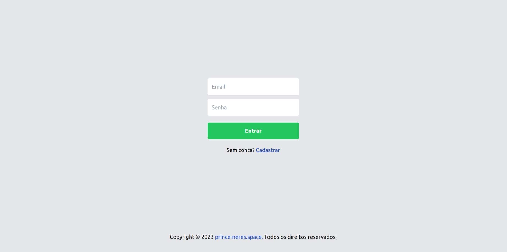
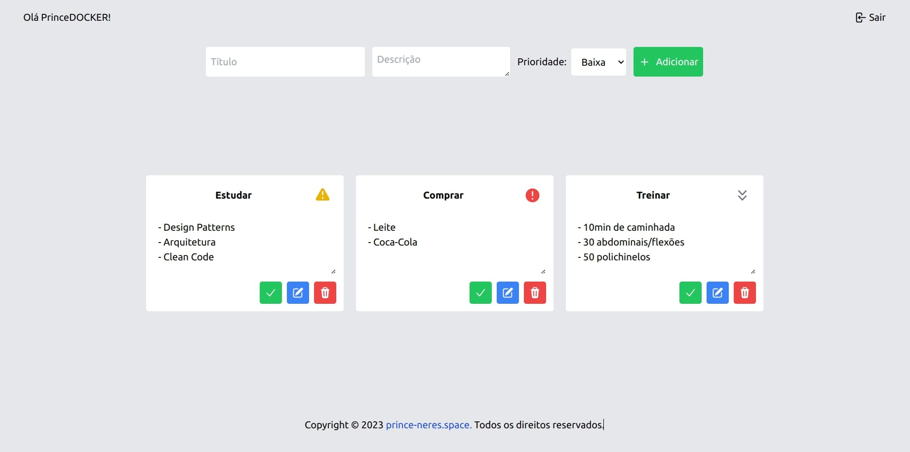

# To-Do List

## Requisitos

- Docker Compose version v2.17.2

## Como executar:

1. Clone o repositório com `https://github.com/prince-neres/desafio-junior-backend-simplify.git`
2. Entre no diretório do projto com `cd desafio-junior-backend-simplify`
3. Execute `docker compose up --build`

## Previews

<h3 align="center">Login</h3>

  

<h3 align="center">Tarefas</h3>

  

## Funcionalidades do Software

O software possui as seguintes funcionalidades:

### Login e Cadastro de Usuário

Permite que os usuários façam login na aplicação ou criem uma nova conta. Cada usuário tem sua própria conta para gerenciar suas tarefas de forma individual.

- **Cadastro de Usuário**: Os usuários podem se registrar fornecendo um nome de usuário, endereço de e-mail e senha. Essas informações são usadas para criar uma nova conta de usuário.

- **Login de Usuário**: Os usuários registrados podem fazer login na aplicação usando seu endereço de e-mail e senha. Isso permite que eles acessem suas tarefas e realizem operações de CRUD.

### CRUD de Tarefas do Usuário

Os usuários podem gerenciar suas tarefas por meio das seguintes operações CRUD:

- **Criar Tarefa**: Os usuários podem criar novas tarefas especificando um título, descrição, prioridade e status da tarefa. Ao criar uma tarefa, ela será associada ao usuário logado.

- **Recuperar Tarefas**: Os usuários podem recuperar a lista de suas tarefas. Essa lista inclui informações como o ID da tarefa, ID do usuário associado, título, descrição, prioridade, status, data de criação e data de atualização da tarefa.

- **Atualizar Tarefa**: Os usuários podem atualizar informações de uma tarefa existente. Eles podem modificar o título, descrição, prioridade e status da tarefa. A atualização é restrita apenas às tarefas associadas ao usuário logado.

- **Deletar Tarefa**: Os usuários podem excluir uma tarefa específica. A exclusão é restrita apenas às tarefas associadas ao usuário logado.

Essas funcionalidades permitem que os usuários organizem e gerenciem suas tarefas de acordo com suas necessidades individuais.
